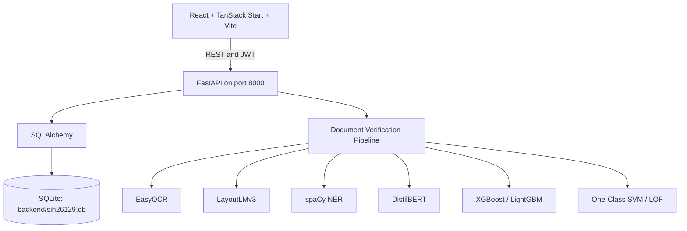

# GovFlow Connect

## Inter-Governmental Mesh and AI Document Verification Platform

GovFlow Connect is a GovTech interoperability platform for coordinating citizen services across government departments and digital public infrastructure. It brings applications, consent-based data sharing, workflow progress, connected platforms, audit events, and AI-assisted document verification into one system.

This repository contains the complete working stack:

- FastAPI backend with JWT authentication and REST APIs.
- SQLite persistence managed through SQLAlchemy.
- Seeded demonstration data for departments, services, applications, users, mesh platforms, consents, documents, and audit logs.
- React 19 + TanStack Start/Vite frontend.
- Typed frontend API client connected through the Vite `/api` proxy.
- Multi-stage document verification using OCR, layout analysis, entity recognition, semantic classification, risk scoring, and anomaly detection.
- Windows scripts for installation and one-click startup.

## What This Project Does

Government services often require a citizen to submit the same information to multiple departments and systems. GovFlow models a shared interoperability layer where:

1. A citizen submits a service application.
2. The application moves through a cross-department workflow.
3. Data is shared for an explicit consent purpose.
4. Connected platforms can be monitored and checked for availability.
5. Important actions are represented in an audit trail.
6. Submitted documents can be evaluated by the AI verification pipeline before officer review or approval.

This is a local demonstration and development platform. The seeded external platform URLs represent mesh integration metadata; they are not live government integrations from this repository.

## Main Capabilities

### Applications and workflows

- JWT login, signup, and current-user profile APIs.
- Government service catalog with departments, service codes, descriptions, and dynamic form schemas.
- Application creation, listing, detail views, reference tracking, and status updates.
- Application workflow stages with progress and retry-style state support.
- Seeded citizen, officer, and administrator accounts.

### Consent and auditability

- Consent records identify the citizen, purpose, source platform, target platform, and expiry.
- Consent can be revoked through the API.
- Audit records capture actions across applications, documents, consents, and integrations.

### Interoperability monitoring

- Mesh platform records for DigiLocker, UIDAI, SAMARTH, PFMS, GSTN, and Mahabhulekh.
- Platform status, API version, owning department, and integration metadata.
- Platform ping endpoint for a local health/latency-style check.
- Dashboard aggregates for applications, departments, services, active mesh nodes, consents, audit events, verified documents, API success rate, latency, and detected anomalies.

### AI document verification

The full verification pipeline combines:

1. **EasyOCR** for text extraction and word bounding boxes.
2. **LayoutLMv3 integration** for document layout and authenticity signals.
3. **spaCy NER** for government identifiers and entity extraction.
4. **DistilBERT integration** for service intent, semantic alignment, urgency, and sentiment signals.
5. **XGBoost or LightGBM** for structured fraud-risk and approval-probability scoring.
6. **One-Class SVM and Local Outlier Factor** for unsupervised anomaly detection.

The result includes a verdict, confidence score, fraud risk, extracted identities, verification steps, recommendations, and processing time. Text can be supplied directly for development and testing; a base64 image can also be supplied to the OCR/layout stages.

## Architecture



## Repository Structure

```text
.
|-- backend/
|   |-- app/
|   |   |-- api/v1/       REST routers
|   |   |-- core/         Security and JWT helpers
|   |   |-- ml/           AI engines and verification pipeline
|   |   |-- models/       SQLAlchemy models
|   |   |-- schemas/      Pydantic request/response schemas
|   |   `-- main.py       FastAPI application
|   |-- seed_db.py        Demo database seeder
|   `-- requirements.txt  Backend dependencies
|-- backend-node/         Optional Node workflow/connectors prototype
|-- frontend/
|   `-- govflow-connect-main/govflow-connect-main/
|       |-- src/          React, TanStack routes, components, API client
|       `-- package.json   Frontend scripts and dependencies
|-- test_backend.py       End-to-end backend smoke test
|-- requirements.txt      Root Python dependency list
|-- install_all.bat       Install dependencies and seed the database
|-- start_backend.bat     Start only FastAPI
|-- start_frontend.bat    Start only Vite
|-- start_all.bat         Start both services in separate Windows windows
`-- start_all.ps1         Start both services from PowerShell
```

## Requirements

- Windows 10 or later.
- Python 3.10 or newer recommended.
- Node.js 18 or newer and npm.
- Internet access the first time Python or npm dependencies are installed.
- Enough disk space for PyTorch, Transformers, EasyOCR, and model/runtime dependencies.

Check the tools:

```powershell
python --version
node --version
npm --version
```

## Installation

From the repository root:

```powershell
cd "C:\Users\user\Projects\SIH_Proj. 129"
.\install_all.bat
```

The installer installs the Python requirements, runs `npm install` in the frontend directory, and creates/seeds `backend/sih26129.db`.

Manual installation:

```powershell
python -m pip install -r requirements.txt
Set-Location "frontend\govflow-connect-main\govflow-connect-main"
npm install
Set-Location "..\..\..\backend"
python seed_db.py
```

The seeder avoids duplicating the normal seeded dataset when applications already exist. Use `python seed_db.py --force` only when you intentionally want to clear and recreate the demo data.

## Running the Application

### Recommended: two terminals

Terminal 1, from the repository root:

```powershell
cd "C:\Users\user\Projects\SIH_Proj. 129"
.\start_backend.bat
```

Terminal 2, from the same root:

```powershell
cd "C:\Users\user\Projects\SIH_Proj. 129"
.\start_frontend.bat
```

This makes backend and frontend logs easy to read independently.

### One-command launch

```powershell
.\start_all.bat
```

This opens two separate Command Prompt windows, one for each service. The PowerShell equivalent is:

```powershell
.\start_all.ps1
```

The services are still separate processes when launched through one script. If the PowerShell launcher closes with an error, use the two-terminal method so the original service error remains visible.

## Local URLs

| Service | URL |
| --- | --- |
| Frontend | http://localhost:3000 or the Vite URL printed in the frontend terminal |
| Backend root | http://127.0.0.1:8000 |
| Swagger API docs | http://127.0.0.1:8000/docs |
| ReDoc API docs | http://127.0.0.1:8000/redoc |
| Backend health | http://127.0.0.1:8000/health |
| API system health | http://127.0.0.1:8000/api/v1/system/health |
| API information | http://127.0.0.1:8000/api/v1/info |

The frontend sends `/api/*` requests through Vite to `http://127.0.0.1:8000`. Start the backend before testing data-backed frontend screens.

## Demo Accounts

All seeded demo users use the passwords shown below. Do not use these credentials in a real deployment.

| Role | Email | Password |
| --- | --- | --- |
| Administrator | `admin@govflow.in` | `Admin@123` |
| Revenue officer | `officer@revenue.gov.in` | `Officer@123` |
| Transport officer | `transport.officer@maha.gov.in` | `Officer@123` |
| Citizen | `aarav.patel@gmail.com` | `Citizen@123` |
| Citizen | `ramesh.patil@gov.in` | `Citizen@123` |

The seeder creates additional citizen records with the same demo citizen password.

## Backend API Overview

All versioned endpoints use the `/api/v1` prefix.

| Area | Routes |
| --- | --- |
| System | `GET /system/health`, `GET /info` |
| Authentication | `POST /auth/login`, `POST /auth/signup`, `POST /auth/oauth/token`, `GET /auth/me` |
| Departments | `GET /departments`, `GET /departments/{id}`, `POST /departments` |
| Services | `GET /services`, `GET /services/{id}`, `GET /services/{id}/form-schema`, `POST /services` |
| Applications | `GET /applications`, `POST /applications`, `GET /applications/{id}`, `GET /applications/track/{reference_id}`, `GET/PATCH /applications/{id}/workflow`, `PATCH /applications/{id}/status` |
| Platforms | `GET /platforms`, `GET /platforms/{id}`, `POST /platforms`, `POST /platforms/{id}/ping` |
| Consents | `GET/POST /consents`, `GET /consents/{id}`, `POST /consents/{id}/revoke` |
| Audit | `GET/POST /audit-logs` |
| Statistics | `GET /stats/dashboard` |
| Documents | `GET /documents`, `GET /documents/{id}`, `POST /documents/upload-and-verify` |
| ML | `GET /ml/status` plus individual OCR, layout, NER, classification, risk, anomaly, and verification routes |

Complete request and response schemas are available in Swagger at `/docs`.

## Example API Checks

With the backend running:

```powershell
Invoke-RestMethod http://127.0.0.1:8000/health
Invoke-RestMethod http://127.0.0.1:8000/api/v1/info
Invoke-RestMethod http://127.0.0.1:8000/api/v1/ml/status
Invoke-RestMethod http://127.0.0.1:8000/api/v1/stats/dashboard
```

Run the complete backend smoke test:

```powershell
python test_backend.py
```

It checks health, system information, ML readiness, admin login, current-user access, departments, platforms, services, applications, consents, dashboard statistics, and document verification.

## Frontend Commands

```powershell
Set-Location "frontend\govflow-connect-main\govflow-connect-main"
npm run dev       # Start Vite
npm run typecheck # Check TypeScript
npm run lint      # Run ESLint
npm run build     # Create a production build
npm run preview   # Preview the production build
```

The frontend API client defaults to `http://127.0.0.1:8000/api/v1`. Set `VITE_API_URL` before starting Vite to use a different backend URL.

## Backend Commands

From the `backend` directory:

```powershell
python -m uvicorn app.main:app --host 127.0.0.1 --port 8000 --reload
```

The application creates missing tables and ensures required service catalog/application columns during startup. Local defaults point to `backend/sih26129.db`.

## Configuration and Security Notes

The defaults are for local development:

- The JWT secret is a development default in `backend/app/config.py`.
- CORS allows all origins by default.
- SQLite is the local database.
- Demo passwords are predictable and documented here.
- Seeded platform URLs are metadata, not production credentials or live service access.

Before deployment, configure a strong secret, restrict CORS, use a production database, manage secrets outside source control, enable HTTPS, and replace seeded credentials.

## Troubleshooting

### `python` or `npm` is not recognized

Install Python or Node.js, add it to `PATH` if prompted, reopen PowerShell, and verify with `python --version` or `node --version`.

### Frontend says the backend is unavailable

Confirm the backend is running:

```powershell
Invoke-RestMethod http://127.0.0.1:8000/health
```

If this fails, inspect the backend terminal for a missing dependency, port conflict, or model initialization error.

### Port 8000 is already in use

Stop the process using port 8000 or start Uvicorn on another port. If the port changes, update `VITE_API_URL` or the Vite proxy configuration.

### The PowerShell all-in-one launcher exits with code 1

Run `start_backend.bat` and `start_frontend.bat` in separate terminals. This exposes the original service error and confirms which process failed.

### AI models initialize slowly

Some libraries may download or initialize model assets on first use. Keep the backend terminal open and wait for startup to finish before calling ML endpoints.

## Project Status

The repository provides an integrated local demonstration of the GovFlow concept: a working FastAPI data and AI backend, seeded SQLite records, and a connected React frontend. Production integrations, real government credentials, deployment infrastructure, and hardened security configuration still require environment-specific implementation.
